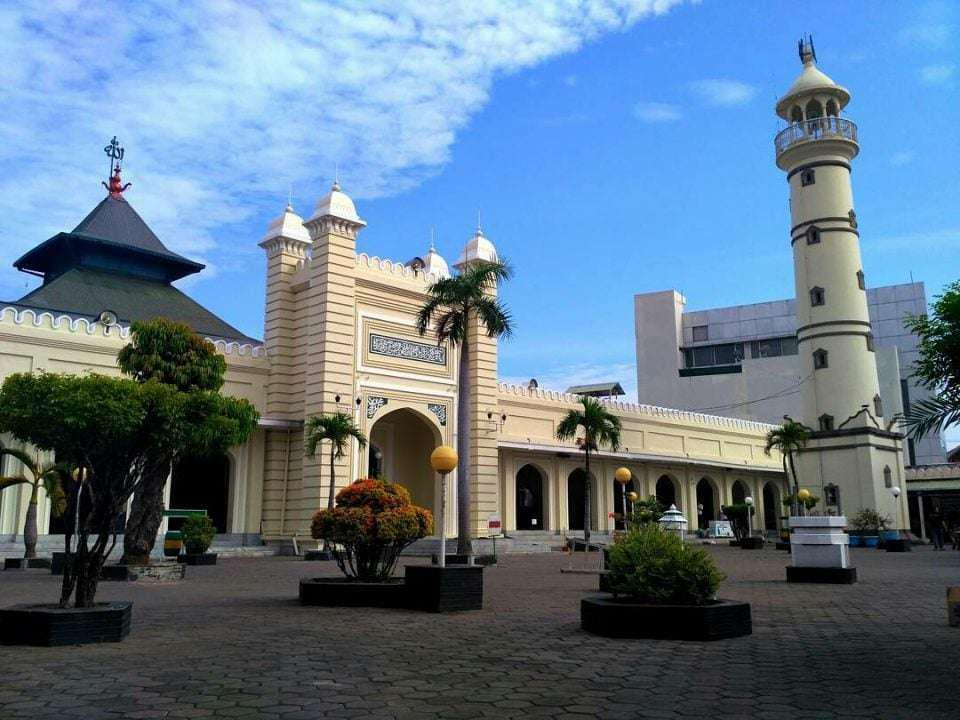

<!DOCTYPE html>
<html lang="id">
<head>
    <meta charset="UTF-8">
    <meta name="viewport" content="width=device-width, initial-scale=1.0">
    <link rel="stylesheet" href="styles.css">
    <title>Ragam Pekalongan</title>
    
</head>
<body>
    <header>
        <h1>Ragam Pekalongan</h1>
        <nav>
            <ul>
                <li><a href="#tempat">Tempat Wisata</a></li>
                <li><a href="#galeri">Galeri</a></li>
                <li><a href="#kontak">Kontak</a></li>
            </ul>
        </nav>
    </header>
    <main>
        <section id="tempat">
            <h2>Tempat Wisata Religi</h2>
            

                <h3>Masjid Agung Pekalongan</h3>
                
Masjid Agung dengan arsitektur pilar-pilar kayu dan ornamen yang masih asli.

            

            

                <h3>Pura Kalinnga Satya Dharma </h3>
                
sebuah pura yang terletak di desa linggoasri,Kajen,Pekalongan,

            

        </section>
        <section id="galeri">
            <h2>Galeri</h2>
            

                
            

            

                
            

        </section>
        <section id="kontak">
            <h2>Kontak Kami</h2>
            
Email: @ragam-pekalongan.com

            
Telepon: 082324985383

        </section>
    </main>
    <footer>
        
&copy; 2024 Ragam Pekalongan. All rights reserved.

    </footer>
</body>
</html>
